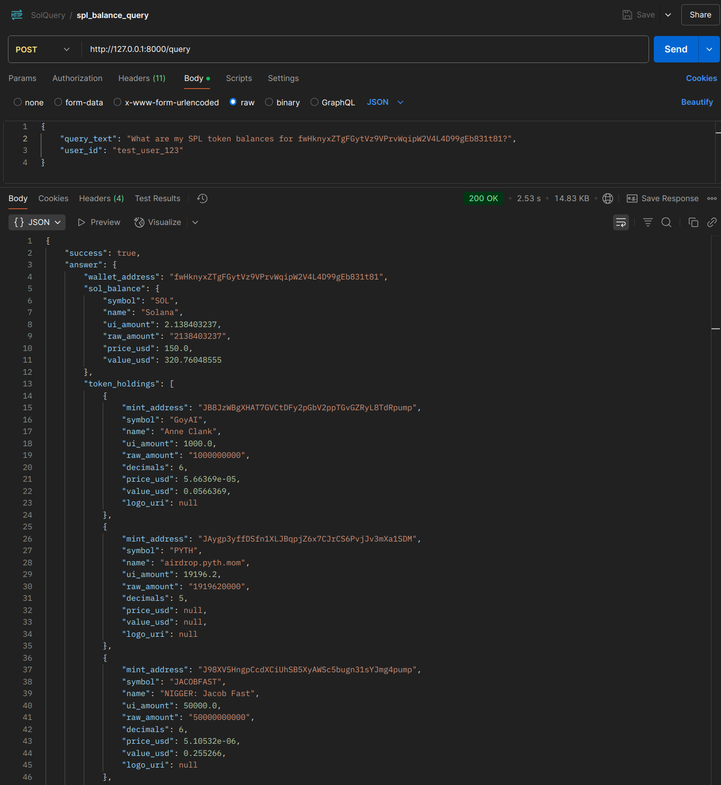

## License

This project is licensed under the GNU General Public License v3.0 or later.
See the [LICENSE](LICENSE) file for the full license text.

## Table of Contents

1.  [Overview & Vision](#overview--vision)
2.  [Key Features](#key-features)
3.  [Technology Stack (SolQuery Backend Service)](#technology-stack-solquery-backend-service)
4.  [Setup Instructions (SolQuery Backend)](#setup-instructions-solquery-backend)
5.  [Running the SolQuery Backend Service](#running-the-solquery-backend-service)
6.  [Testing the SolQuery Backend API](#testing-the-solquery-backend-api)
7.  [Agent Client Examples & Demos](#agent-client-examples--demos)
8.  [Hackathon Context](#hackathon-context)
9.  [🚀 Future Work & Long-Term Vision](#future-work--long-term-vision)
    * [I. Expanding Data Horizons & Integration Flexibility](#i-expanding-data-horizons--integration-flexibility)
    * [II. Advancing AI & Query Capabilities](#ii-advancing-ai--query-capabilities)
    * [III. Personalization & Advanced Features](#iii-personalization--advanced-features)
    * [IV. New Core Features & Integrations](#iv-new-core-features--integrations)

---

## Overview & Vision

Building powerful AI agents on high-performance blockchains like Solana presents a significant data challenge. Developers often grapple with:
* **Data Fragmentation:** Integrating countless raw RPC endpoints and diverse third-party APIs for on-chain and off-chain information.
* **LLM Compatibility:** Raw blockchain data is not inherently structured for optimal Large Language Model (LLM) consumption, leading to potential hallucinations or inefficient tool use.
* **Development Overhead:** Significant time spent on data "plumbing" rather than core AI logic and user experience.

**SolQuery addresses these pain points by offering:**
* **Unified Data Access:** A single, intelligent API endpoint for a wide range of Solana data (balances, SPL tokens, NFTs) and use-case-specific information (e.g., curated Fukuoka local data for our demo).
* **LLM-Powered Routing:** Internally, SolQuery uses Google Gemini with advanced function calling to understand natural language queries, select the appropriate data-fetching tools, and extract necessary parameters.
* **Developer-Friendly Tooling:** Designed to be easily integrated as a "tool" into various AI agent frameworks like Langchain or Fetch.ai uAgents.

Our vision is for SolQuery to become the go-to data intelligence layer for AI development on Solana, fostering a new wave of sophisticated and data-aware decentralized applications.

## Key Features

* **Natural Language Querying:** Understands complex user requests via its internal LLM.
* **Rich Solana Data:** Access to SOL balance, SPL token details (with prices), NFT holdings and metadata (via Helius).
* **Use-Case Specific Data:** Demonstrated with a (currently mocked) Fukuoka local dataset for services, events, and crypto payment information, aligning with regional revitalization themes.
* **Sentiment Analysis:** Capability to analyze text sentiment related to Solana assets using Google Gemini.
* **Portfolio Management:** Aggregates DeFi and NFT holdings for a comprehensive overview.
* **Designed for AI Agents:** Provides structured, LLM-friendly responses.

## Technology Stack (SolQuery Backend Service)

* **Backend Framework:** Python 3.11+ with FastAPI
* **Primary LLM (Internal Routing & Analysis):** Google Gemini (via `google-generativeai` SDK)
* **Solana Data Integration:** Helius API (for RPC & DAS API calls)
* **HTTP Client:** `httpx`
* **Data Validation:** Pydantic
* **Configuration:** `python-dotenv`, `pydantic-settings`

## Setup Instructions (SolQuery Backend)

**Prerequisites:**
* Python 3.11+
* `pip` and `venv` (or your preferred virtual environment manager)

**Steps:**

1.  **Clone the Repository:**
    ```bash
    git clone [your-repo-url]
    cd solquery_project
    ```

2.  **Create and Activate Virtual Environment:**
    ```bash
    python -m venv .venv
    source .venv/bin/activate  # On Linux/macOS
    # .\.venv\Scripts\activate    # On Windows CMD
    # .\.venv\Scripts\Activate.ps1 # On Windows PowerShell
    ```

3.  **Install Dependencies:**
    ```bash
    pip install -r requirements.txt
    ```

4.  **Set up Environment Variables:**
    * Copy the example environment file:
        ```bash
        cp .env.example .env
        ```
    * Edit the `.env` file in the `solquery_project/` root and fill in your actual API keys and desired port:
        ```dotenv
        SOLQUERY_FASTAPI_URL=[http://127.0.0.1:8000/query](http://127.0.0.1:8000/query) # Used by clients, ensure port matches below
        SOLQUERY_FASTAPI_PORT=8000 # Port for the SolQuery FastAPI service itself

        HELIUS_API_KEY=your_helius_api_key_string_only 
        GOOGLE_GEMINI_API_KEY=your_google_gemini_api_key

        # Optional, for sentiment text gathering if implemented beyond mocks
        # NEWS_API_KEY=your_news_api_key 

        # Keys/configs for agent_client scripts (ASI1, agent seeds/ports)
        ASI1_API_KEY=YOUR_ACTUAL_ASI1_MINI_API_KEY_HERE
        SOLQUERY_CONNECTOR_AGENT_ADDRESS=
        FUKUOKA_CHAT_UI_AGENT_SEED=your_unique_seed_for_fukuoka_chat_ui_agent
        FUKUOKA_CHAT_UI_AGENT_PORT=8002
        CONNECTOR_AGENT_SEED=your_unique_seed_for_connector_agent
        SOLQUERY_CONNECTOR_AGENT_PORT=8001
        ```

## Running the SolQuery Backend Service

1.  Ensure your virtual environment is activated.
2.  Navigate to the `solquery_project` root directory.
3.  Run Uvicorn:
    ```bash
    uvicorn solquery.main:app --reload --port [YOUR_CONFIGURED_SOLQUERY_FASTAPI_PORT]
    ```
    For example, if `SOLQUERY_FASTAPI_PORT=8000` in your `.env` (and `config.py` loads it for logging, though Uvicorn CLI arg takes precedence for binding):
    ```bash
    uvicorn solquery.main:app --reload --port 8000
    ```
4.  The SolQuery API will be live, and interactive documentation (Swagger UI) will be available at `http://127.0.0.1:PORT/docs` (e.g., `http://127.0.0.1:8000/docs`).

## Testing the SolQuery Backend API

You can send `POST` requests to the `/query` endpoint (e.g., `http://127.0.0.1:8000/query`) using tools like Postman or `curl`.

* **Method:** `POST`
* **Headers:** `Content-Type: application/json`
* **Body (JSON Example):**
    ```json
    {
        "query_text": "What is the SOL balance for 3tA8PjUvrep7UT9LNWnHZQmQ5bg646YuZnt7xLiQAXEe?",
        "user_id": "postman_tester_01"
    }
    ```

**Example Successful Response Snippet:**
```json
{
    "success": true,
    "answer": {
        "get_sol_balance": {
            "wallet": "3tA8PjUvrep7UT9LNWnHZQmQ5bg646YuZnt7xLiQAXEe",
            "balance_lamports": 100000000, 
            "source": "Helius RPC (getBalance)"
        }
    },
    "data_source_used": "Tool: get_sol_balance",
    "llm_trace": { /* ... details of LLM routing ... */ },
    "error": null
}
```

**Example Postman test on a more complex query:**


## Agent Client Examples & Demos

This project includes an `agent_client/` directory with examples of how AI agents and applications can use SolQuery. This includes:
* A Streamlit-based chat demo (`fukuoka_chat_demo.py`) for the "Fukuoka Nomad Assistant" use case (integrating Fetch.ai's ASI1-Mini for parts of its logic).
* Fetch.ai uAgent implementations (`solquery_connector_agent.py`, `fukuoka_chat_ui_agent.py`) showing the intended architecture for the Fetch.ai track.
* A generic Langchain agent test script (`main_agent_script.py`).

For details on setting up and running these clients, please see the [agent_client/README.md](agent_client/README.md).

## Hackathon Context

* **Solana Breakout Hackathon:** SolQuery serves as a foundational tool to accelerate AI development on Solana.
* **Fetch.ai Track (Fukuoka Nomad Assistant):** The `agent_client` examples showcase how SolQuery can power Fetch.ai uAgents using ASI1-Mini to solve real-world problems like assisting digital nomads and contributing to regional revitalization in Fukuoka.
    * *(Consider embedding the Fetch.ai tools diagram from your uploaded `image_30a7ec.jpg` here or referencing it if it explains your uAgent architecture well).*
* **Telegram Validation:** The need for improved data access for AI agents on Solana was highlighted in community discussions from previous events, underscoring the problem SolQuery addresses.
    * *(Consider embedding or referencing your uploaded `image_bac9c2.png` - the Murat Telegram screenshot - here).*

## 🚀 Future Work & Long-Term Vision

SolQuery aims to be the definitive intelligent data layer for AI agents on Solana. Our MVP establishes the core, but our vision extends much further. Here’s what we’re planning:

### I. Expanding Data Horizons & Integration Flexibility

Our goal is to provide comprehensive and adaptable data access:

* **Richer & Diverse Data Sources:**
    * Integrate a wider array of **on-chain data** beyond current capabilities.
    * Incorporate relevant **off-chain data sources** (e.g., project-specific news, curated knowledge bases).
    * Add deeper **social media sentiment analysis** by integrating with more platforms and refining analysis techniques.
* **Expanded Provider Ecosystem:**
    * Integrate with more specialized data providers as needed, such as NFT marketplace APIs from **Magic Eden, OpenSea**, and other relevant platforms.
* **User-Configurable & On-Demand Data:**
    * Allow users or AI agents to dynamically **choose or even add their own trusted data sources** through a configurable system.
* **Generalization of Data Source Methods:**
    * Refactor and generalize internal data fetching methods (e.g., for Helius `getBalances`, `getAsset`, and other RPC/DAS calls like those detailed at [Helius RPC Methods](https://www.helius.dev/docs/api-reference/rpc/http-methods) and [Helius DAS API](https://www.helius.dev/docs/api-reference/das/getasset)) to easily support a wider range of parameters and extend to new provider endpoints with minimal code changes. This involves more modular design in `data_sources.py` and flexible argument delegation from `main.py`.

### II. Advancing AI & Query Capabilities

We plan to significantly enhance the intelligence and sophistication of SolQuery's core:

* **Comprehensive Intent & Entity Handling:**
    * Develop more advanced **intent classification, entity recognition, and entity linking** capabilities, potentially using multi-stage LLM pipelines for greater accuracy with complex queries.
* **Specialized AI Models:**
    * Explore **training or fine-tuning our own language models** specifically optimized for searching, indexing, and understanding blockchain data and business-centric queries on Solana.
* **Complex Query Support & Community-Driven Refinement:**
    * Enable and **test more complex, multi-faceted queries based on user profiles and needs**, by establishing a community of users and developers to gather requirements and feedback.

### III. Personalization & Advanced Features

Tailoring the experience and offering powerful new functionalities:

* **Personalized Search Experience:**
    * Introduce **user profiles** to store preferences, default wallet addresses, and areas of interest.
    * Enable **credentials-enabled services** for accessing private or permissioned data where appropriate and authorized.
* **Specialized Endpoints & Analytics:**
    * Develop **specialized API endpoints** catering to specific high-demand services, such as large batch transaction processing or complex analytical queries.
    * Incorporate more **on-the-fly analytics capabilities** directly into query results (e.g., advanced sorting, filtering, basic statistical analysis).

### IV. New Core Features & Integrations

Adding high-value tools and insights directly into SolQuery:

* **Identity-to-Wallet Mapping:**
    * Explore methods to (permissively and ethically) **link on-chain identities or social profiles to wallet addresses** to provide richer context.
* **Whale Wallet Identification & Tracking:**
    * Develop a tool for **identifying and tracking significant wallet activities ("whales")**, potentially drawing inspiration or data from services like Nansen.ai (similar to their [Whale Alert features](https://www.nansen.ai/whale-alert)) or on-chain analysis of DEX activity (e.g., from Jupiter Exchange).
* **Enhanced Transaction History & Portfolio Tracking:**
    * Provide even more **detailed and filterable transaction history** for wallets.
    * Offer deeper **portfolio tracking and summarization features**, including historical performance and profit/loss calculations.
* **Solana Priority Fee Recommendations:**
    * Integrate a tool to provide **real-time recommendations for Solana priority fees** to help users and agents optimize transaction inclusion and cost.
